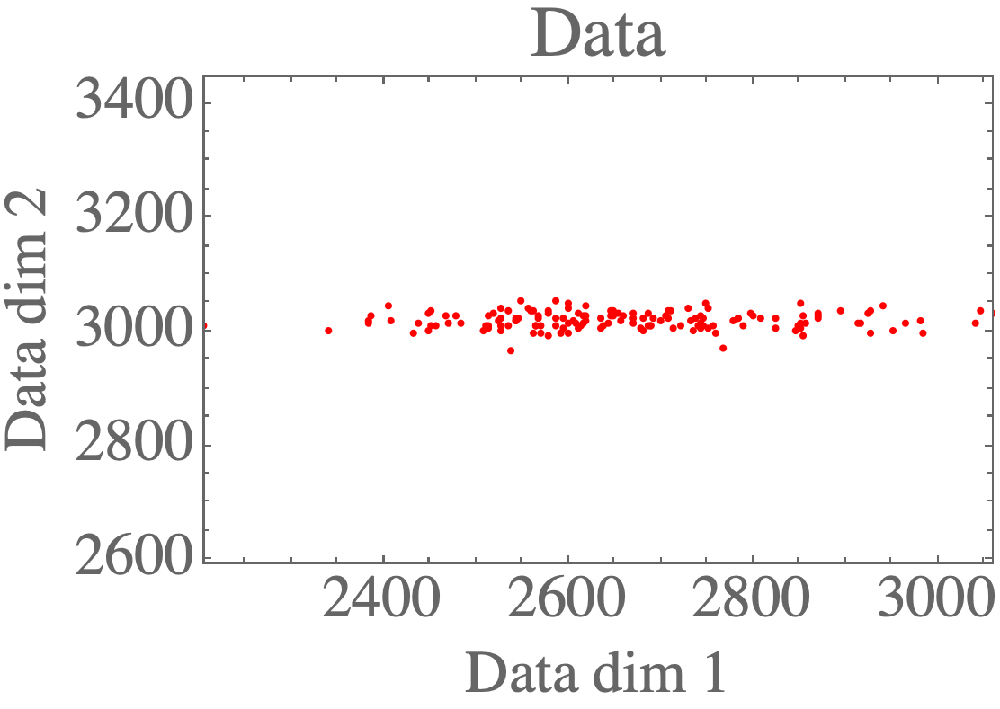
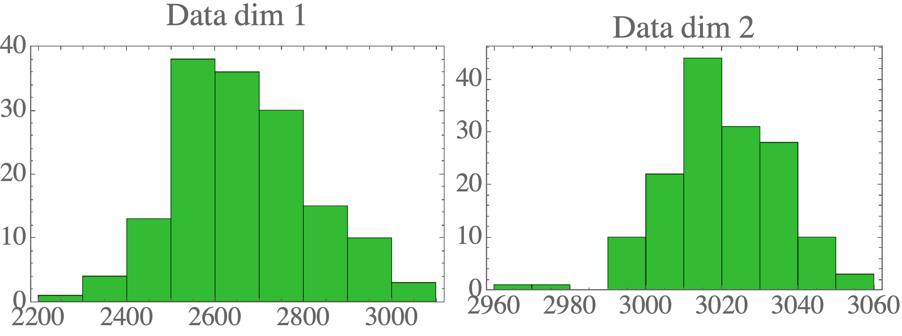
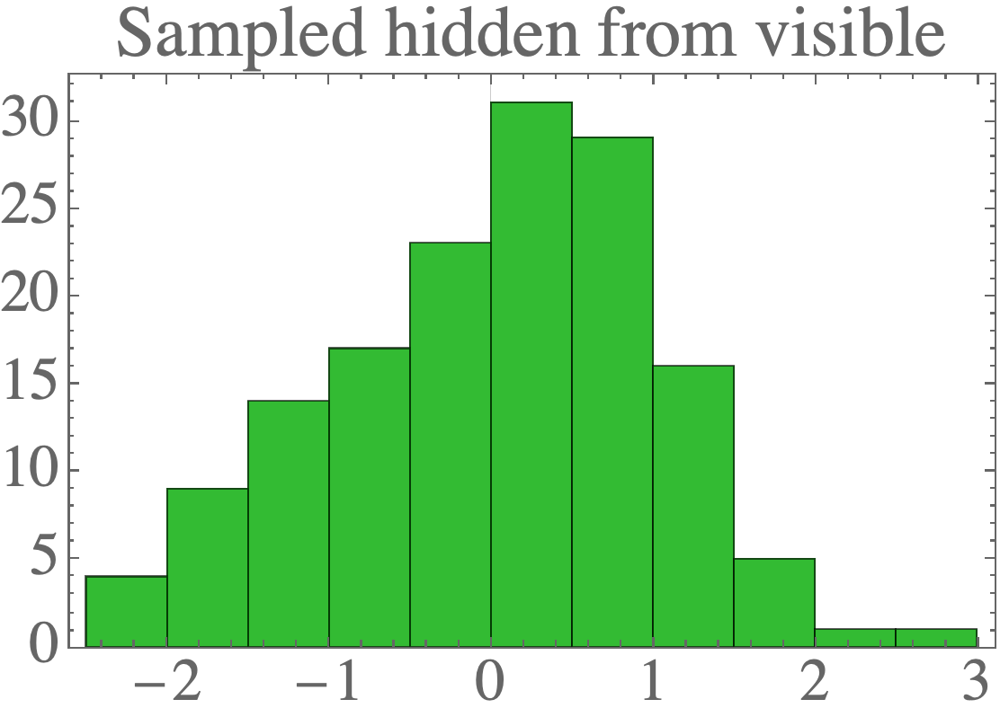
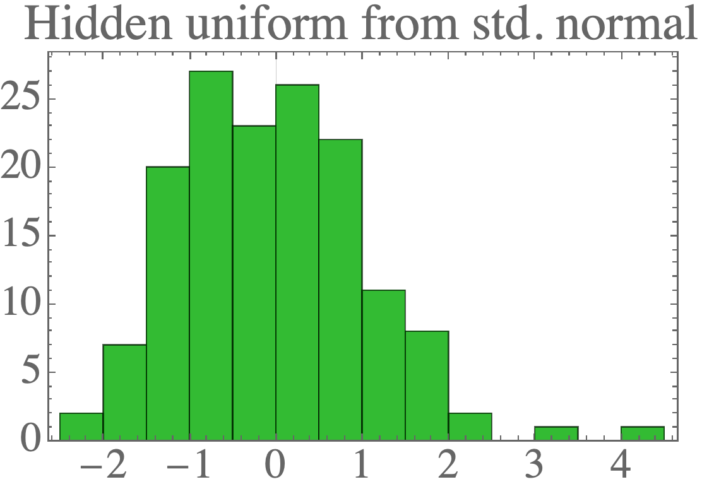
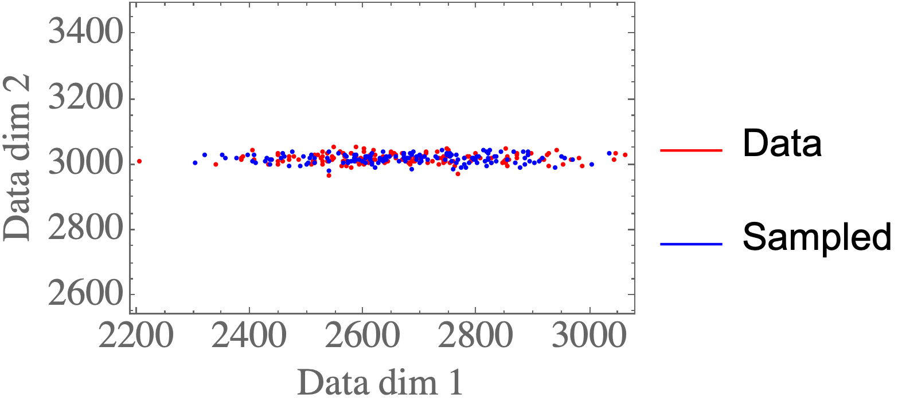
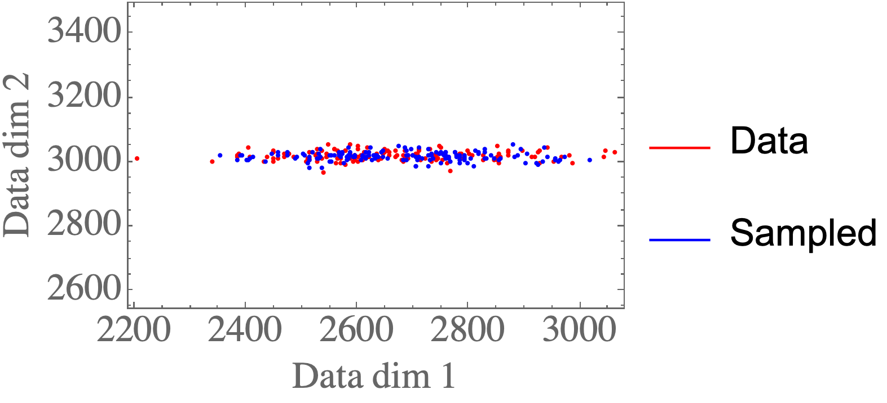
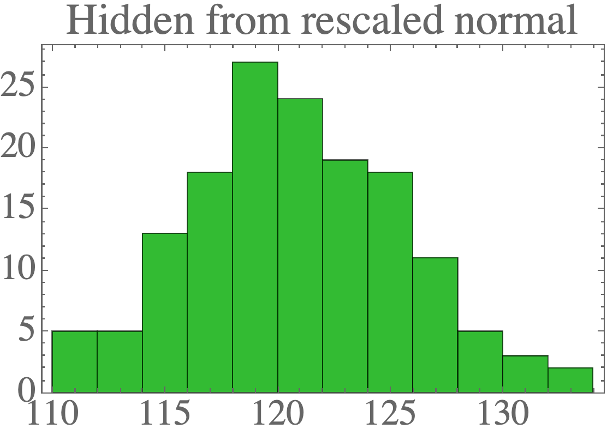
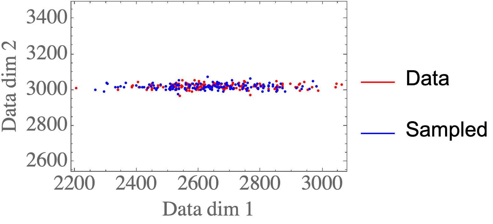
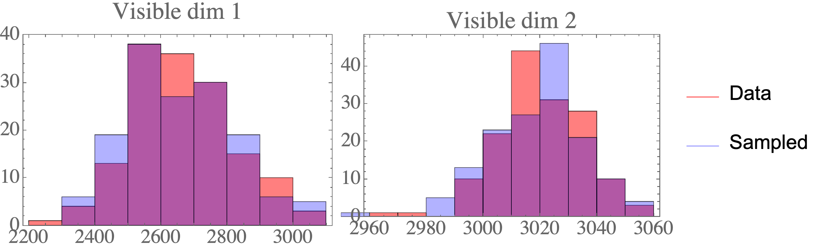

# Tutorial on probabilistic PCA in Python and Mathematica

## Running

* Python: `python prob_pca.py`. The figures are output to the [figures_py](figures_py) directory.
* Mathematica: Run the notebook `prob_pca.nb`. The figures are output to the [figures_ma](figures_ma) directory.

## Description

Consider 2D data such as the following:

After determining the ML parameters, we can sample the hidden units from the visible:

We can also draw new samples from the hidden distribution (a standard normal):

and then sample new visible samples from those:

Finally, we can rescale the latent variables to have any Gaussian distribution:

We can simply transform the parameters and then **still** sample new valid visible samples from those:

