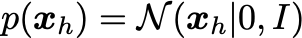
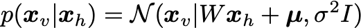
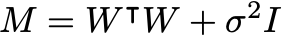
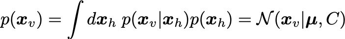
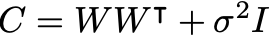
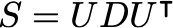
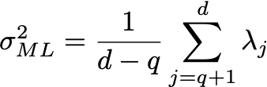
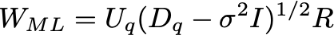
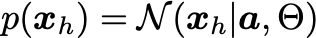
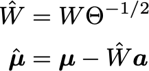

# Tutorial on probabilistic PCA in Python and Mathematica

## Running

* Python: `python prob_pca.py`. The figures are output to the [figures_py](figures_py) directory.
* Mathematica: Run the notebook `prob_pca.nb`. The figures are output to the [figures_ma](figures_ma) directory.

## Description

You can find more information in the original paper: ["Probabilistic principal component analysis" by Tipping & Bishop](https://www.jstor.org/stable/2680726?seq=1#metadata_info_tab_contents).

### Import data

Let's import and plot some 2D data:
```
data = import_data()

d = data.shape[1]

print("\n---\n")

mu_ml = np.mean(data,axis=0)
print("Data mean:")
print(mu_ml)

data_cov = np.cov(data,rowvar=False)
print("Data cov:")
print(data_cov)
```
You can see the plotting functions in the complete repo. Visualizing the data shows the 2D distribution:


### Max likelihood

Assume the latent distribution has the form:



The visibles are sampled from the conditional distribution:




From these, the marginal distribution for the visibles is:




We are interested in maximizing the log likelihood:


where `S` is the covariance matrix of the data. The solution is obtained using the eigendecomposition of the data covariance matrix `S`:



Where the columns of `U` are the eigenvectors, and `D` is a diagonal matrix with the eigenvalues `\lambda`. Let the number of dimensions of the dataset be `d` (in this case, `d=2`). Let the number of latent variables be `q`, then the maximum likelihood solution is:




and `\mu` are just set to the mean of the data.

Here the eigenvalues `\lambda` are sorted from high to low, with `\lambda_1` being the largest and `\lambda_d` the smallest. Here `U_q` is the matrix where columns are the corresponding eigenvectors of the `q` largest eigenvalues, and `D_q` is a diagonal matrix with the largest eigenvalues. `R` is an arbitrary rotation matrix - here we can simply take `R=I` for simplicity (see Bishop for a detailed discussion). We have discarded the dimensions beyond `q` - the ML variance `\sigma^2` is then the average variance of these discarded dimensions. 

Here is the corresponding Python code to calculate these max-likelihood solutions:
```
# No hidden variables < no visibles = d
q = 1

# Variance
lambdas, eigenvecs = np.linalg.eig(data_cov)
idx = lambdas.argsort()[::-1]   
lambdas = lambdas[idx]
eigenvecs = - eigenvecs[:,idx]
print(eigenvecs)
# print(eigenvecs @ np.diag(lambdas) @ np.transpose(eigenvecs))

var_ml = (1.0 / (d-q)) * sum([lambdas[j] for j in range(q,d)])
print("Var ML:")
print(var_ml)

# Weight matrix
uq = eigenvecs[:,:q]
print("uq:")
print(uq)

lambdaq = np.diag(lambdas[:q])
print("lambdaq")
print(lambdaq)

weight_ml = uq * np.sqrt(lambdaq - var_ml * np.eye(q))
print("Weight matrix ML:")
print(weight_ml)
```

### Sampling latent variables

After determining the ML parameters, we can sample the hidden units from the visible according to:


You can implement it in Python as follows:
```
act_hidden = sample_hidden_given_visible(
    weight_ml=weight_ml,
    mu_ml=mu_ml,
    var_ml=var_ml,
    visible_samples=data
    )
```
where we have defined:
```
def sample_hidden_given_visible(
    weight_ml : np.array, 
    mu_ml : np.array,
    var_ml : float,
    visible_samples : np.array
    ) -> np.array:

    q = weight_ml.shape[1]
    m = np.transpose(weight_ml) @ weight_ml + var_ml * np.eye(q)

    cov = var_ml * np.linalg.inv(m)
    act_hidden = []
    for data_visible in visible_samples:
        mean = np.linalg.inv(m) @ np.transpose(weight_ml) @ (data_visible - mu_ml)
        sample = np.random.multivariate_normal(mean,cov,size=1)
        act_hidden.append(sample[0])
    
    return np.array(act_hidden)
```

The result is data which looks a lot like the standard normal distribution:


### Sample new data points

We can sample new data points by first drawing new samples from the hidden distribution (a standard normal):
```
mean_hidden = np.full(q,0)
cov_hidden = np.eye(q)

no_samples = len(data)
samples_hidden = np.random.multivariate_normal(mean_hidden,cov_hidden,size=no_samples)
```


and then sample new visible samples from those:
```
act_visible = sample_visible_given_hidden(
    weight_ml=weight_ml,
    mu_ml=mu_ml,
    var_ml=var_ml,
    hidden_samples=samples_hidden
    )

print("Covariance visibles (data):")
print(data_cov)
print("Covariance visibles (sampled):")
print(np.cov(act_visible,rowvar=False))

print("Mean visibles (data):")
print(np.mean(data,axis=0))
print("Mean visibles (sampled):")
print(np.mean(act_visible,axis=0))
```
where we have defined:
```
def sample_visible_given_hidden(
    weight_ml : np.array, 
    mu_ml : np.array,
    var_ml : float,
    hidden_samples : np.array
    ) -> np.array:

    d = weight_ml.shape[0]

    act_visible = []
    for data_hidden in hidden_samples:
        mean = weight_ml @ data_hidden + mu_ml
        cov = var_ml * np.eye(d)
        sample = np.random.multivariate_normal(mean,cov,size=1)
        act_visible.append(sample[0])
    
    return np.array(act_visible)
```

The result are data points that closely resemble the data distribution:


### Rescaling the latent distribution

Finally, we can rescale the latent variables to have any Gaussian distribution:



For example:
```
mean_hidden = np.array([120.0])
cov_hidden = np.array([[23.0]])
no_samples = len(data)
samples_hidden = np.random.multivariate_normal(mean_hidden,cov_hidden,size=no_samples)
```


We can simply transform the parameters and then **still** sample new valid visible samples from those:



Nota that `\sigma^2` is unchanged from before.

In Python we can do the rescaling:
```
weight_ml_rescaled = weight_ml @ np.linalg.inv(sl.sqrtm(cov_hidden))
mu_ml_rescaled = mu_ml - weight_ml_rescaled @ mean_hidden

print("Mean ML rescaled:")
print(mu_ml_rescaled)

print("Weight matrix ML rescaled:")
print(weight_ml_rescaled)
```
and then repeat the sampling with the new weights & mean:
```
act_visible = sample_visible_given_hidden(
    weight_ml=weight_ml_rescaled,
    mu_ml=mu_ml_rescaled,
    var_ml=var_ml,
    hidden_samples=samples_hidden
    )
```

Again, the samples look like they could come from the original data distribution:


